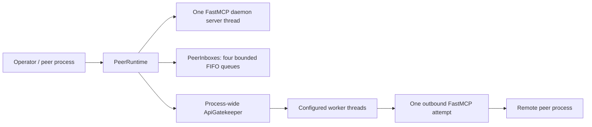

# Concurrency, Lifecycle, and Capacity

> Retrospective baseline created after the validated prototype.
> These documents did not exist before the prototype and do not claim otherwise.

This document defines the implemented concurrency contract. It does not change game rules,
MatchProfile bytes, interoperability semantics, retry/deadline behavior, or the frozen competitive
policy.

## Process and ownership model



- Each Police or Thief peer is a separate operating-system process with no shared game state.
- The peer process owns one FastMCP server thread. The current transport API deliberately binds
  that daemon thread to process lifetime: process termination is the cleanup boundary, and an
  in-process server restart/stop handle is not supported or claimed.
- `PeerInboxes` owns four independent bounded `queue.Queue` instances, one per wire tool. The
  consumer removes accepted values in FIFO order. A full inbound queue applies blocking
  backpressure; it does not silently drop or reorder an accepted value.
- The caller that obtains the process-wide `ApiGatekeeper` owns its final `close()`. The Gatekeeper
  owns its configured worker threads and all accepted outbound work until the waiting caller has
  received a result or the original exception.
- Policy calculation remains synchronous and deterministic. Threads are used only at I/O and
  queue boundaries; there is no hidden multiprocessing inside one peer.

## Admission, capacity, and shutdown

Gatekeeper admission and closure use one state lock. An `execute()` call either enqueues and counts
its item before `close()` closes admission, or deterministically raises `RuntimeError`; it cannot
pass a stale open check and become stranded after shutdown.

The exact maximum accepted outbound load is:

```text
concurrent_max active calls + queue_max queued calls
```

The next immediate admission raises `GatekeeperBackpressure`. The accepted-work counter spans the
dequeue-to-in-flight transition, so `drain()` cannot falsely report empty during that interval.
`close()` refuses new work, waits at most one second for accepted calls, and then waits at most one
second per worker for exit. A drain timeout is visible to the owner. It does not reopen admission:
when the outstanding call later finishes, workers observe closed-plus-empty state and reap
themselves. Calling `close()` again completes the join.

Each of the four inbound peer queues has its configured `queue_max` capacity. This is per queue,
not one shared allowance across all tools.

## Locks and exception paths

- The Gatekeeper state lock protects admission state, pending/in-flight counters, high-watermark,
  and sanitized metrics. It is never held while waiting for rate capacity or executing an external
  call.
- `RateWindow` owns a separate internal lock. No path holds the Gatekeeper state lock while
  acquiring the rate lock, so there is no nested lock-order cycle.
- `queue.Queue` owns the producer/consumer handoff. Callers wait on a per-item event rather than on
  a shared condition.
- An external-call exception is stored only until its original caller receives and re-raises that
  same exception. The worker remains available, and monitoring retains only the operation label,
  outcome, duration, and exception type—not arguments, responses, credentials, nonces, or bodies.
- Rate limits, queue sizes, and monitoring retention are loaded from the strict versioned
  operational configuration. Frozen FastMCP retry count, ordering, and monotonic deadline remain
  in `McpPeerClient` and are unchanged.

## Deterministic validation

```bash
uv run pytest -q tests/integration/test_configuration/test_gatekeeper_lifecycle.py --no-cov
uv run pytest -q tests/integration/test_configuration/test_gatekeeper.py \
  tests/integration/test_configuration/test_gatekeeper_config.py --no-cov
uv run pytest
uv run ruff check src tests
```

The focused lifecycle suite uses local threads and events only. It exercises the execute/close
admission race, timeout cleanup after a blocked call, exact worker-plus-queue capacity, and explicit
backpressure. It opens no listener, tunnel, public connection, or opponent contact.

