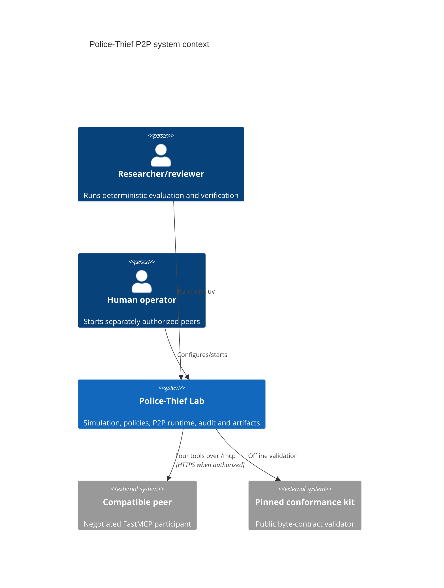
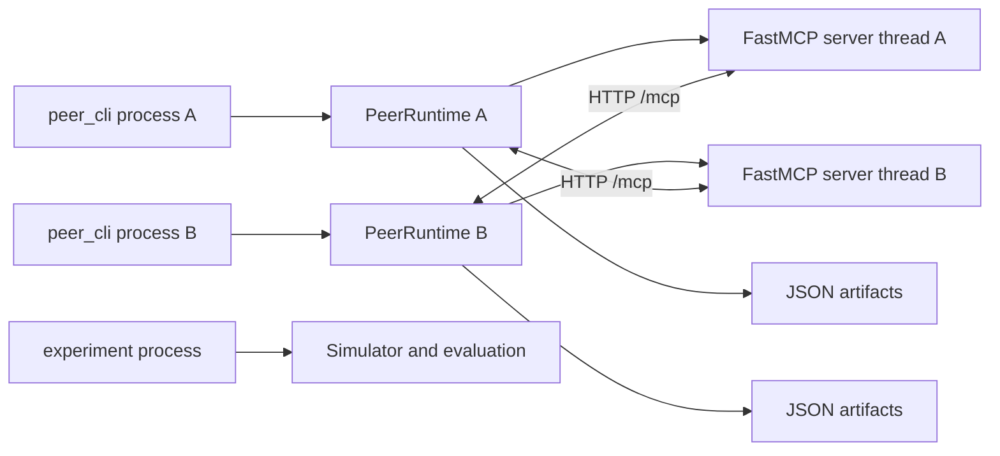
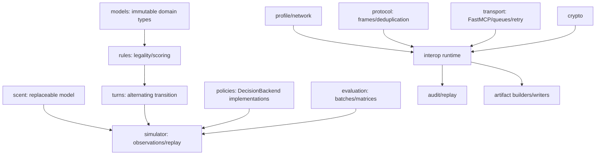
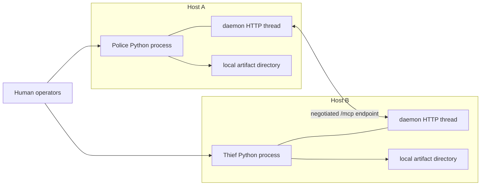
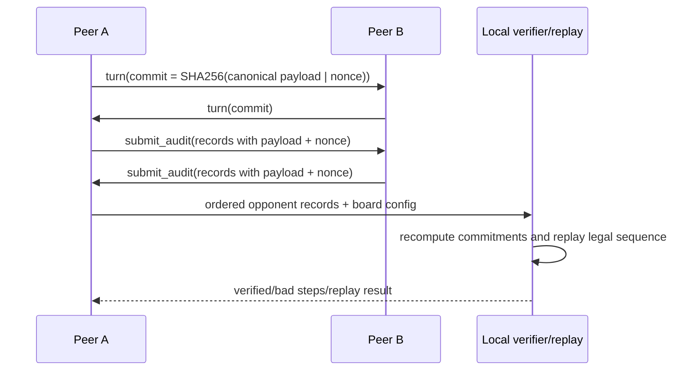
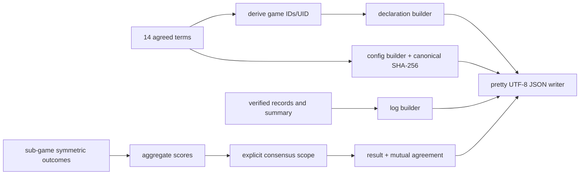

# As-Built Architecture Plan

> Retrospective baseline created after the validated prototype.
> These documents did not exist before the prototype and do not claim otherwise.

This section describes implemented version 1.0.0. Proposed work is isolated under **Proposed
architecture**. Authority remains [the rules/interoperability baseline](../RULES_AND_INTEROP_BASELINE.md).

## System context



## Containers/processes



Each peer is an independent process with local truth. Each server runs in one daemon thread;
`PeerInboxes` provides four thread-safe, currently unbounded `queue.Queue`s. Outbound calls are
synchronous and create an async FastMCP client per attempt. There is no shared peer memory.

## Main components



## Deployment topology



Localhost two-process deployment is proven. Public transport was previously validated under
explicit phase controls; no current real-team or counted readiness is claimed.

## Complete P2P turn

```mermaid
sequenceDiagram
  participant T as Thief runtime
  participant QP as Police turn queue
  participant P as Police runtime
  T->>T: choose legal action; apply; seal full payload
  T->>QP: receive_turn(TurnMessage)
  QP-->>T: {ok: true}
  P->>QP: dequeue; validate step/commit
  P->>P: absorb scent/barrier/claim; check terminal
  P->>P: choose/apply action; seal payload
  P->>T: receive_turn(TurnMessage)
  T-->>P: {ok: true}
  Note over T,P: retry repeats identical logical dict; duplicates do not extend deadline
```

## Commit-reveal audit and replay



## Artifact-generation flow



## Modules and interfaces

- `sdk/*`: the documented single consumer entry point, split into domain, policy, evaluation,
  artifact, transport, and configuration services; existing modules remain implementations.
- `models`, `rules`, `scent`, `turns`, `simulator`: domain types, legal actions, scent protocol,
  transition model, `DecisionBackend`, role observations, `Simulator`, and `replay`.
- `policies/*`: interchangeable observed-state decision backends; tactical champion is frozen.
- `evaluation/*`: `run_game`, `run_batch`, `cross_play`, typed results and renderers.
- `interop/profile.py`: `MatchProfile` bytes/hash, 14 reference terms, agreement validation.
- `interop/protocol.py`: `TurnMessage`, `TurnInbox`, violations/equivocation.
- `interop/transport.py`: `PeerInboxes`, four-tool server, discovery, `McpPeerClient`.
- `interop/runtime.py`: public `PeerRuntime` assembly and `run_peer`; lifecycle, board, sending,
  audit, artifact, and state/conversion responsibilities are isolated in `runtime_*.py` modules.
- `interop/crypto.py`, `replay.py`, `artifacts.py`: frozen commitment API, audit/replay, official
  artifact and consensus functions.
- `configuration.py`: strict versioned operational-startup loader and value-redacting secret scan;
  it is deliberately outside MatchProfile and frozen game/interoperability bytes.
- `peer_cli.py`: argument parsing plus one typed `PeerLaunchRequest` delegation. The SDK transport
  service validates optional operational configuration, reads profile timeouts, validates the
  endpoint, and invokes the existing runtime behind that boundary.

Current package structure is feature/layer hybrid under `src/police_thief_lab`; tests are flat,
experiments are executable evidence generators, reports are recorded evidence, `interop` holds
fixtures/templates/vectors/log evidence, and `external` holds pinned dependencies/submodules.

## Data, boundaries, and failure behavior

Key schemas are dataclasses (`GameConfig`, state/observation/action, `MatchProfile`, `TurnMessage`),
JSON fixtures, ten-key turn frames, audit record lists, and declaration/config/log/result schema
1.1 objects. Exact artifact fields and hash domains are linked from
[interop decisions](INTEROP_DECISIONS.md); they are not redefined here.

Security boundaries: process-local hidden truth; observation-only strategies; profile/hash lock;
commit-reveal; URL validation/redaction; no credentials in artifacts/docs; external professor code
is unavailable/nonredistributable; the MIT kit is an external pinned boundary and is not modified.

Illegal actions raise or are handled by named runtime behavior; malformed frames and equivocation
fail; profile mismatch stops before play; outbound retry stops at count or monotonic deadline;
missing turns/audits become deterministic technical failure. Queues are thread-safe but unbounded.
Daemon-server lifecycle and call monitoring are limited. Duplicate traffic cannot renew turn time.

Extension points already implemented: `DecisionBackend`, `ScentModel`, policy factories,
`BarrierPlacementMode`, evaluation scenarios, and named match profiles. Risks: flat tests, absent
rate/backpressure controls, runtime lifecycle complexity, and negotiated scope ambiguity. REF-001
closed with no Python source/test file above 150 counted lines. CFG-001 closed with a strict
versioned operational boundary; SDK-001 closed with a single documented facade. Fixed game/profile
values remain non-configurable.

## Remaining proposed architecture

Proposals only: applicability and design of gatekeeper controls
([ADR-004](adr/ADR-004-api-gatekeeper-applicability.md)) and offline release tooling per
[workstream](RELEASE_ENGINEERING_WORKSTREAM.md). The
[SDK facade](adr/ADR-003-sdk-facade-plan.md) is implemented and accepted. REF-001's
semantics-preserving splits are implemented, and
[ADR-006](adr/ADR-006-versioned-configuration-boundary.md) is implemented and accepted. No
remaining proposal may silently change frozen or negotiated behavior.
