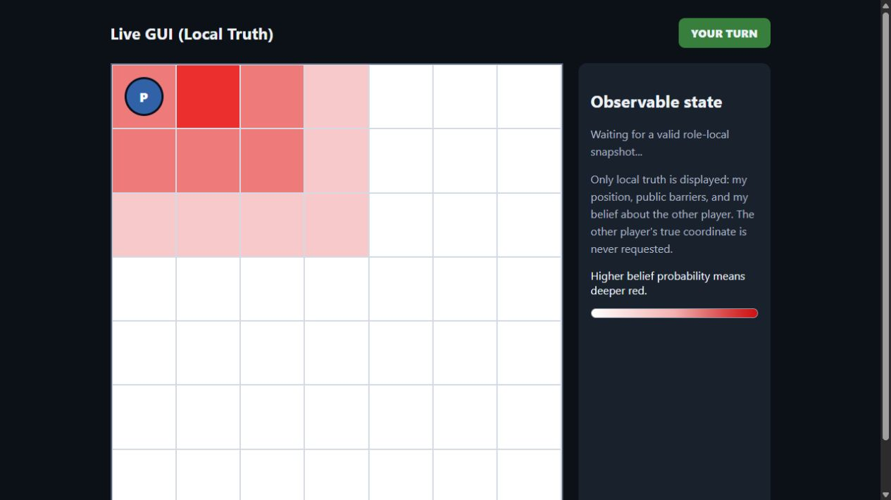
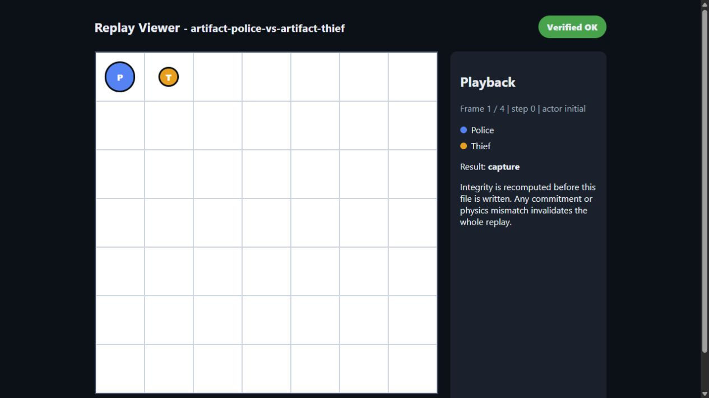

# Live GUI and Offline Replay Viewer

## Purpose and authority

The two viewers implement the official Chapter 7 observability boundary without modifying game
physics, the frozen competitive policy, commitment dialect, wire messages, or artifacts. Neither
viewer authorizes gameplay.

The live and replay boundaries are deliberately different:

- `RoleLocalView` contains only the peer's own position, public obstacles/barriers, legal belief
  values, step, and turn banner. It has no opponent-position field.
- `ReplayView` is created only from a completed revealed log. It may show both tracks after Python
  has recomputed every commitment and deterministic transition.

## Run the Live GUI

Each independent peer may publish its own role-local snapshot feed by receiving an optional
`--live-view` path. Police and Thief must use different paths and different browser ports.

Append `--live-view artifacts/police-live.json` to that role's already reviewed peer command, then
run the loopback viewer:

```bash
uv run python -m police_thief_lab.viewer_cli live \
  --snapshot artifacts/police-live.json \
  --host 127.0.0.1 \
  --port 8765
```

Open `http://127.0.0.1:8765/` locally. The app polls the atomic bounded feed and renders the
role-local position, static cells, public barriers, scent-derived belief heatmap, step, and exact
`YOUR TURN`, `LOCKED`, `GAME OVER`, or `ERROR` banner. Previous/Next controls inspect the bounded
snapshot history; `Follow latest` resumes the live edge.

The HTTP server refuses non-loopback addresses, uses no remote assets, sends no-store and browser
security headers, and validates the exact feed field set before serving it. An extra field such as
`opponent_position` fails closed. The feed deliberately excludes wire records, commitments,
nonces, URLs, and objective opponent truth.

## Build a Replay viewer

Use the schema 1.1 log and matching config from the same completed sub-game:

```bash
uv run python -m police_thief_lab.viewer_cli replay \
  --log artifacts/log_<game-id>_g01.json \
  --config artifacts/config_<game-id>_g01.json \
  --output artifacts/replay_<game-id>_g01.html
```

Open the resulting HTML file with a normal browser. The app is standalone: it has no CDN, remote
font, analytics, network request, or runtime dependency. `Previous step` and `Next step` move across
the post-game board states. Police, Thief, static blocked cells, and placed barriers are visibly
distinct.

## Verification and exit codes

Before rendering, the command calls the accepted commitment verifier and deterministic replay
physics. The output model intentionally excludes input records and nonces.

| Exit | Meaning | HTML banner |
|---:|---|---|
| `0` | Every commitment and replay transition verified | `Verified OK` |
| `2` | At least one commitment, structure, or physics check failed | `TAMPERED` |

`TAMPERED` invalidates the whole replay. The viewer does not offer a repair, override, warning-only
mode, or implicit acceptance path.

## Supported inputs and limitations

The viewer accepts the current flat schema 1.1 config fields (`board_size`, `cop_start`,
`thief_start`) and the older local runtime's nested `board_config` for retained regression evidence.
It consumes `records` from the log root and uses the summary result only as display metadata.

## Reviewed visual evidence

Both images were captured from one synthetic localhost two-peer self-test. They contain no live
endpoint, credential, nonce, retained wire body, or real opponent identity.





The Live screenshot proves the presentation shape, not another-team interoperability. The Replay
screenshot proves that the retained synthetic log passed verification, not that a counted match
occurred. Phase 4D7C closes the shared-code `GUI-001` implementation; final role-repository
assembly and every external operation remain separate tasks.

No public transport, external opponent, Gmail, league reporting, or counted operation is needed to
test this viewer.
